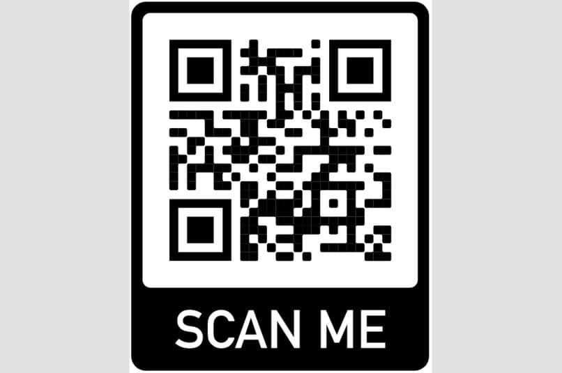

# ONE TRACK

## Inspiration
Nowadays, there is no possibility for actors involved in freight transportation to track & trace precisely a single piece unit, from origin factory to its final destination, using a single tool and in a unified manner.

Last year we developped a first part of ONE Track, aiming to provide a unified multi-modal realtime Track and Trace view of every steps of a shipment, from production factory to the consignee. This year, we wanted to focus on how to actually produce the data, that is to say to provide a ONE Track application that can be used by technicians during their daily work, to scan, track, trace or monitor goods handled.

## What it does
During this IATA ONE Record Hackathon we developed an application called ONE Track.

This application is intended for all technicians involved in the entire logistics transport chain, from the factory to the consignee. The application is connected to the ONE Record Internet of Logistics as well as to a DCSA server. Thus, the application can be used in a multi-modal transport scenario, including sea, road, and air transport.

The technician using the app can:

scan a qr code label on a Piece or Item (container, pallet, package, ...)
have access to information about this Piece, as well as potential specific instructions like special handling to guide him, depending on the type of goods and the role of the technician.
have access to track&trace information of the Piece or Item by displaying the list of associated events (in a unified way including ONE Record and DCSA events).
have access to IoT data monitored by IoT devices associated to the Piece or Item, if any, and check if data is compliant with handling instructions.
send events corresponding to the task being done, for example "Piece received at warehouse", with timestamp, emitter company and location information.

## Try it out!

Scan the below QR code or click the link https://track.onerecord.fr/.

